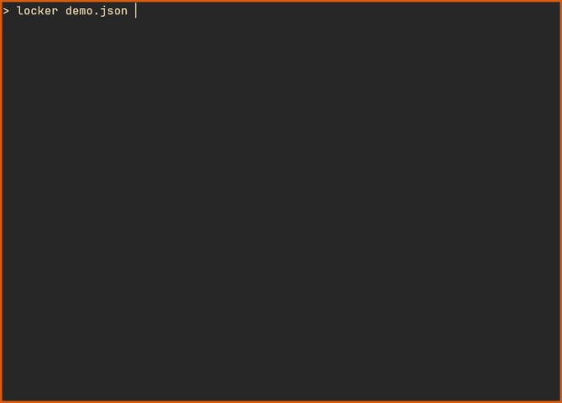

# locker

<p align="center"></p>

## Description

`locker` is a TUI-based program for viewing JSON files. It was originally created to read `flake.lock` files used by the [Nix package manager](https://nixos.org/). It is written in [Rust](https://www.rust-lang.org/) and uses [ratatui](https://ratatui.rs/) to render its terminal interface.

## Usage

`locker` takes the path to the file you want to open as an argument:
```
locker <FILE>
```

While running, `locker` allows you to select values from the file. Upon exiting the program, the selected values will be printed to `stdout`, each on a new line - as shown in the demo above.

For a full list of arguments and options, run:
```
locker --help
```

Originally, `locker` was developed to simplify updating inputs in `flake.lock` using a script like the following:
```
# update-inputs.sh

flake_dir="some/path/to/flake/dir"

mapfile -t flake_inputs < <(locker "$flake_dir/flake.lock")
if [[ ${#flake_inputs[@]} -eq 0 ]]; then
  echo "No inputs provided"
else
  nix flake update "${flake_inputs[@]}" --flake "$flake_dir"
fi
```

### Keybindings

| Key                 | Action                           |
|---------------------|----------------------------------|
| q / Esc / Ctrl+C    | Quit the application             |
| Enter / Space       | Select entry                     |
| A                   | Select all entries in the column |
| c / Backspace       | Clear all selected entries       |
| ↓↑←→ / jkhl         | Move cursor                      |
| Shift+↓↑ / Shift+jk | Resize left table                |
| Ctrl+↓↑ / Ctrl+jk   | Resize right table               |

## Features

`locker` comes with its own JSON parser that adopts a fairly lenient approach to the JSON specification. This allows it to parse standard JSON files as well as loosely formatted inputs like the following examples:
```
{
  foo: bar,
  foo: "bar",
  "foo": bar
}
```

```
[
  foo,
  bar,
  baz
]
```

The parser recognizes several kinds of tokens:

| Kind     | Description                                                                                      |
|----------|--------------------------------------------------------------------------------------------------|
| LastChar | Indicates that there are no more tokens                                                          |
| Comma    | ,                                                                                                |
| Colon    | :                                                                                                |
| Object   | {...}                                                                                            |
| Array    | [...]                                                                                            |
| String   | "..."                                                                                            |
| Sequence | A continuous sequence of characters without typical delimiters (`:`, `,`, ` `, `\n`, `\t`, `\r`) |

## Installation

### Using Nix

Add `locker` to your `flake.nix` inputs:
```
inputs = {
  ...
  locker = {
    url = "github:mow44/locker/main";
    inputs = {
      nixpkgs.follows = "nixpkgs";
      flake-utils.follows = "flake-utils";
    };
  };
  ...
};
```

Then include the package:
```
environment.systemPackages = [
  locker.packages.${system}.default
];
```

### Using Cargo (manual installation)

To build and install manually using Cargo:
```
git clone https://github.com/mow44/locker.git
cd locker
cargo install --path . --locked --release
```

## License

[MIT](LICENSE)
